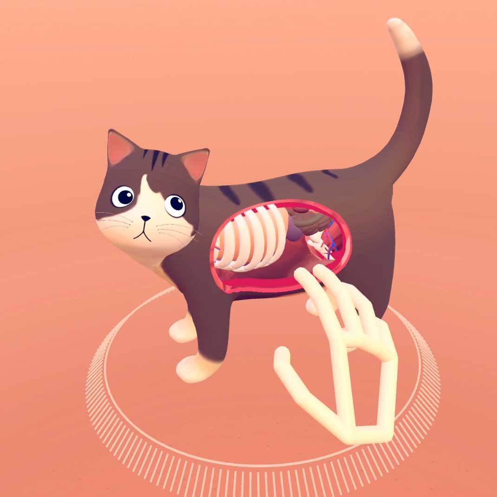

<!-- Main -->

<!-- One -->
<section id="one">
	

	<!-- Content -->

		
	

		<h2 id="rebellion">Rebellion Playground, hosted by Scratchworks Theatre Company</h2>
	

	

		
	

	
	

	
Location: 1st Floor / Dance Studio
 
	
<i class="fa fa-warning"></i> Recommended for ages 16+

	
Step into the Rebellion Playground; a place for game changers, rule breakers, and balloon poppers!

	
This is a new interactive experience for anyone who wants to see change, big or small but doesn't know where to begin. Come and play, bend the rules, be provoked and start a discussion. 
The Playground will be inclusive for all, whether you would prefer to fully participate or to observe. The Scratchworks team are part game masters/ part revolution seekers, providing a series of provocations and tasks to the participants who have agency to accept, refuse or even revolt. 

	<ul>
		<li>Slot 1 : 11.00 - 12.30</li>
		<li>Slot 2 : 13.00 - 14.30</li>
		<li>Slot 2 : 15.00 - 16.30</li>
	</ul>
	
Spaces are limited to 18 people per slot. Due to the <em>rebellious</em> nature of the workshop, under 16s need to be accompanied by an adult.

	<ul class="actions">
		<li><a href="#" class="button next">Reserve your slot (coming soon)</a></li>
	</ul>
	

	

	

	<h2>PONG Rewired, hosted by TechExeter</h2>
	

	
	

	
Location: 1st Floor / Drama Studio

	
Come watch our glitched-out pong game self destruct the more it gets played!  Challenge your friends to a game using our crazy controllers, but do you dare to press the big red button?

	
Join us in our workshop area to build your own controllers and switches to plug into the game. We'll have soldering irons, wire, connectors and electrical components, so just bring your imagination!

	

	

		
	

			
	

	

		<h2 id="cat">Cat Explorer</h2>
	

	

		
	

	
	

	
Location: 1st Floor / Dance Studio
 
	
VR Experiment
 
	
VR interactions have the potential to be easier and more intuitive than with any other technology. Cat Explorer is a fun demo that points to the transformative potential of VR and natural interaction in fields as diverse as education, training, healthcare, and entertainment.

	
Instead of learning how to use a controller, Cat Explorer encourages you to learn through play and experimentation. With no instructions, previous experience or training, people can dive into the space and quickly understand what to do. Get exploring!

	<ul class="actions">
		<li><a href="https://gallery.leapmotion.com/cat-explorer/" class="button small">Learn More</a></li>
	</ul>
	
	

</section>

