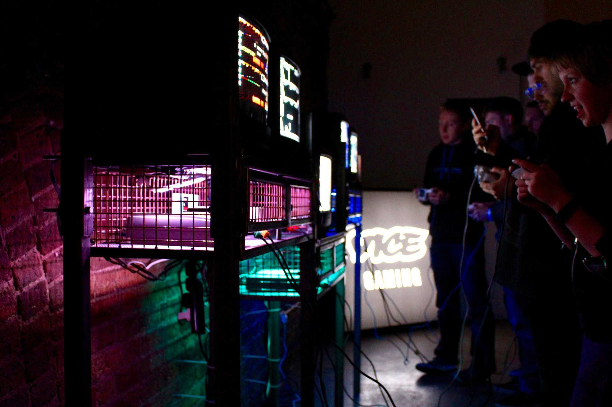
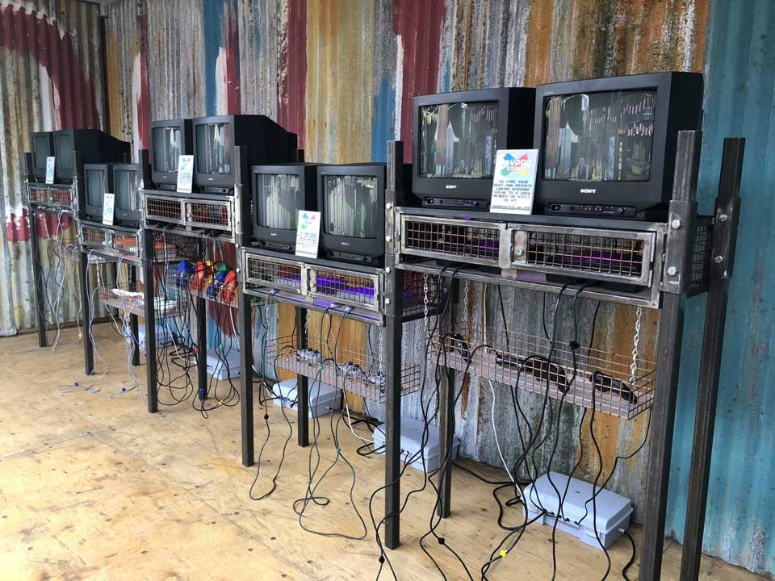
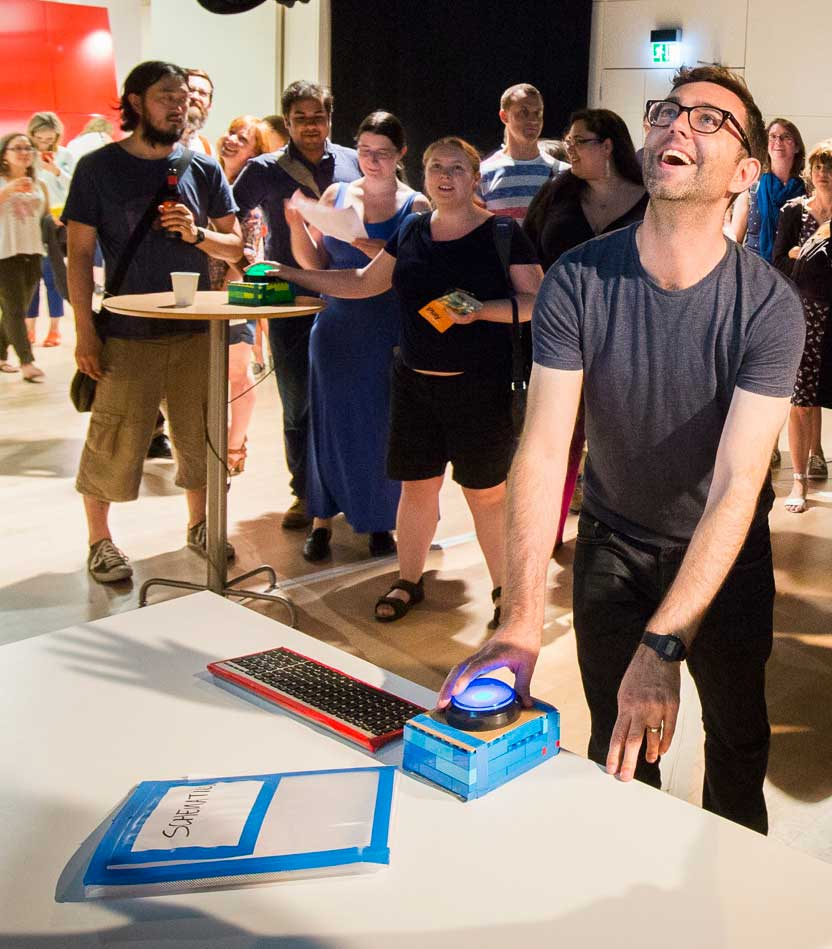
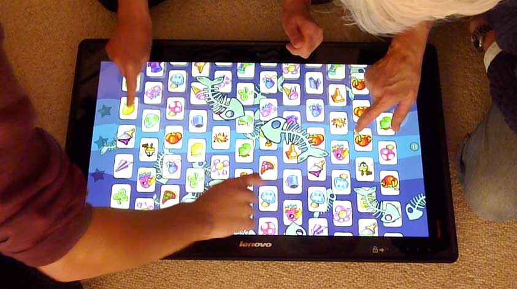

<!-- Main -->

<!-- Two -->
<section id="two" class="spotlights">
	<section>
		
		

			

				<header class="major smallmargin">
					<h3>Joypad Arcade</h3>
				</header>
				
Our friends at London based Joypad Arcade are coming down with their retro hardware to give us 12 stations of gaming goodness, placed throughout the Exeter Phoenix

				
We know everyone has their favourites... Rather break out the special moves in Street Fighter II over Streets of Rage? Prefer to hit the track with Mario Kart or Micro Machines? Sooner settle old scores with Goldeneye or Super Smash Bros.? Whatever your tastes, we should have you covered!

				<ul class="actions">
					<li><a href="http://www.joypadbar.co.uk" class="button small" target="_blank">Learn more</a></li>
				</ul>
			

		

	</section>
	<section>
			
		

			

				<header class="major smallmargin">
					<h3>Triangular Pixels, independent games developers</h3>
				</header>
				<code>Location: Workshop</code>
				
Triangular Pixels are Cornish independent games developers, with a passion for fun, light hearted, and manic local multiplayer gaming. They're bringing their latest games for you to have an exclusive play on!

				
				
<strong>Unseen Diplomacy</strong> casts you as an elite member of The British Espionage Tactical Initiative, defeating the plans of evil-doers around the world. With a real-life obstacle course using every inch of your room-scale space, created by Steam VR, you will run and roll & sneak your way through lairs. 

				<ul class="actions">
					<li><a href="http://www.triangularpixels.net/cms/" class="button small" target="_blank">Learn more</a></li>
				</ul>
			

		

	</section>
	<section>
		
		

			

				<header class="major smallmargin">
					<h3>Codex Bash</h3>
				</header>
				<code>Location: 1st Floor / Meeting Room</code>

				
A game installation designed by Alistair Aitcheson to mix physical movement with teamwork, communication and problem-solving.

				
One physical space, four big buttons and codes to be cracked! Players must use clues scattered around the room to uncover a sequence of button presses, and run around to bash the buttons in the right order.

				
You may have to flip through maps, pick apart circuit diagrams or rifle through a book of spy photos, but one thing’s for certain: the best codebreakers work as a team!

				<ul class="actions">
					<li><a href="https://www.youtube.com/watch?v=evFruZO9YM4" class="button small" target="_blank">Watch on YouTube</a></li>
				</ul>
				
			

		

	</section>
		<section>
			
			

			

				<header class="major smallmargin">
					<h3>Tap Happy Sabotage</h3>
				</header>
				<code>Location: 1st Floor / Drama Studio</code>
				
Tap Happy Sabotage! is a party game by Alistair Aitcheson for as many players that can fit around one giant touchscreen.

				
Divided into a series of fast-and-furious minigames, each round gives the player a new way to move around the screen, a new excuse to get in each other's way and a new way to cheat and sabotage each other!

				<ul class="actions">
					<li><a href="https://www.youtube.com/watch?v=Fd3GZvUWTiE" class="button small" target="_blank">Watch on YouTube</a></li>
				</ul>
			

		

	</section>
</section>

