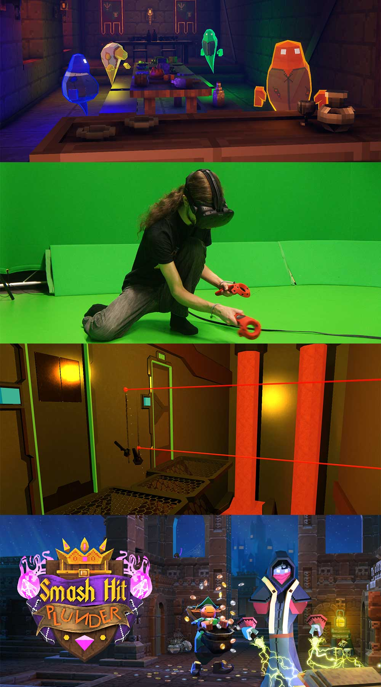

<!-- Main -->

<!-- Two -->
<section id="two" class="spotlights">
	<section>
		
		

			

				<header class="major smallmargin">
					<h3>Joypad Arcade</h3>
				</header>
				
Our friends at London based Joypad Arcade are coming down with their <strong>retro consoles</strong> to give us 12 stations of gaming goodness, which will be placed throughout the Exeter Phoenix. SNES, MegaDrive, GameCube, Dreamcast, N64, PlayStation - we've got them all!

				
We know everyone has their favourite consoles and games - Prefer to break out the special moves in Street Fighter II over Streets of Rage? Rather hit the track with Mario Kart or Micro Machines? Sooner settle old scores with Goldeneye or Super Smash Bros.? Whatever your tastes, we should have you covered!

				<ul class="actions">
					<li><a href="http://www.joypadbar.co.uk" class="button small" target="_blank">Learn more</a></li>
				</ul>
			

		

	</section>
	<section>
		
		

			

				<header class="major smallmargin">
					<h3>Triangular Pixels' VR Expo</h3>
				</header>
				
Location: Workshop

				
Triangular Pixels are award winning Cornish indie games developers, with a passion for fun, light hearted, and manic local multiplayer gaming. They're bringing their latest games for you to have an exclusive play on!

				
				<h3 style="margin:0px;">Unseen Diplomacy</h3>
				
VR: HTC Vive

				
Unseen Diplomacy casts you as an elite member of The British Espionage Tactical Initiative, defeating the plans of evil-doers around the world. It's a real-life obstacle course using every inch of the room-scale space - you will run and roll & sneak your way through volanco lairs and moon bases. 

				<h3 style="margin:0px;">Smash Hit Plunder</h3>
				
VR: Playstation VR

				
It’s time to wreck a castle! Smash alone, together or against friends in VR and TV! Smash Hit Plunder is a physics-based tear-it-up set in a medieval castle. Be a powerful mage with the freedom to roam in first-person, inside a retro isometric game. Fight ghosts, munch food, start fires and cause chaos and collect as much treasure as possible before your time ends!

				<ul class="actions">
					<li><a href="http://www.triangularpixels.net/cms/" class="button small" target="_blank">Learn more</a></li>
				</ul>
			

		

	</section>
	<section>
		
		

			

				<header class="major smallmargin">
					<h3>Codex Bash</h3>
				</header>
				
Location: 1st Floor / Meeting Room

				
A game installation designed by Alistair Aitcheson to mix physical movement with teamwork, communication and problem-solving.

				
One physical space, four big buttons and codes to be cracked! Players must use clues scattered around the room to uncover a sequence of button presses, and run around to bash the buttons in the right order.

				
You may have to flip through maps, pick apart circuit diagrams or rifle through a book of spy photos, but one thing’s for certain: the best codebreakers work as a team!

				<ul class="actions">
					<li><a href="https://www.youtube.com/watch?v=evFruZO9YM4" class="button small" target="_blank">Watch on YouTube</a></li>
				</ul>
				
			

		

	</section>
		<section>
			
			

			

				<header class="major smallmargin">
					<h3>Tap Happy Sabotage</h3>
				</header>
				
Location: 1st Floor / Drama Studio

				
A frantic party game by Alistair Aitcheson for as many players as can fit around one giant touchscreen!

				
Divided into a series of fast-and-furious minigames, each round gives the player a new way to move around the screen, a new excuse to get in each other's way and a new way to cheat and sabotage each other!

				<ul class="actions">
					<li><a href="https://www.youtube.com/watch?v=Fd3GZvUWTiE" class="button small" target="_blank">Watch on YouTube</a></li>
				</ul>
			

		

	</section>
</section>

