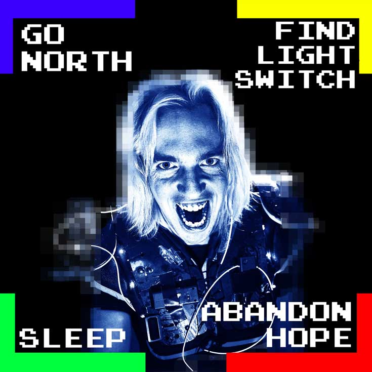

<!-- Main -->

<!-- One -->
<section id="one">
	

<!-- Content -->

Location: Main Auditorium

Tickets to the shows <strong>must be purchased in advance</strong> through the website or purchased on the day from the box office. We've worked hard with our sponsors to keep these ticket prices at just a few pounds each!

		
	

	<h2>The Dark Room</h2>
	

	

		
		<a href="https://www.youtube.com/watch?v=gpAiW6uy_iY" target="_blank"><i class="icon alt fa-youtube" ></i> Watch on youtube</a>
	

	

		<h4>“The Dark Room” is the world’s only live-action videogame. </h4>
		

		Interactive and insane, this is improv comedy + retro gaming fused into a deranged rock n’ roll game show.
 
		<blockquote>YOU AWAKE TO FIND YOURSELF IN… THE DARK ROOM!</blockquote>
		
Created by comedian <a href="https://www.thejohnrobertson.com/thedarkroom/" target="_blank">John Robertson</a>, The Dark Room has appeared in front of audiences ranging from high hundreds to acceptable thousands and since 2010, has had eight consecutive runs at the Edinburgh Fringe. 
		No two shows are the same. No other show is the same. This is THE DARK ROOM!

		
There’s also a child-friendly(ish) version, which took home Best Kid’s Show at Leicester Comedy Festival 2018.

		<ul>
			<li>Show 1 - child-friendly, 13:00</li>
			<li>Show 2 (18+) - adults only, 16:30</li>
		</ul>
		<ul class="actions">
			<li><a href="#" class="button next">Book Tickets (coming soon)</a></li>
		</ul>
	

	

	

	<h2>The Incredible Playable Show</h2>
	

	

		
		<a href="https://www.youtube.com/watch?v=H9hMqFkcH4o" target="_blank"><i class="icon alt fa-youtube" ></i> Watch on youtube</a>

	

	

		<h4>The Incredible Playable Show is an interactive video game comedy show where you, the audience, take to the stage!</h4>

		
Become human buttons, take on the Power Rangers, zap each other with barcode scanners, and play Pac-Man using inflatable toys. Or sit back, and watch your friends literally become cogs in a hilarious machine! 
		

		

		Created by game developer <a href="https://playable.show/" target="_blank">Alistair Aitcheson</a> the show has toured internationally and won the Jury Choice Award at
		IndieCade 2017.

		<ul>
			<li>Show 1 - 11:00</li>
			<li>Show 2 - 15:00</li>
		</ul>

		<ul class="actions">
			<li><a href="#" class="button next">Book Tickets (coming soon)</a></li>
		</ul>
	

<!-- inner -->

</section>

